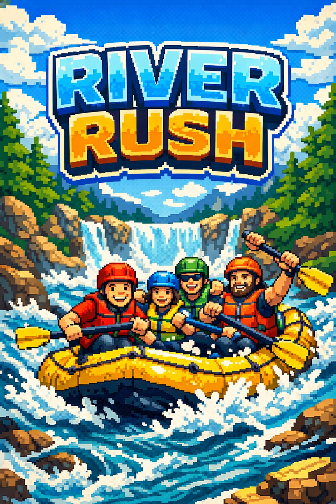
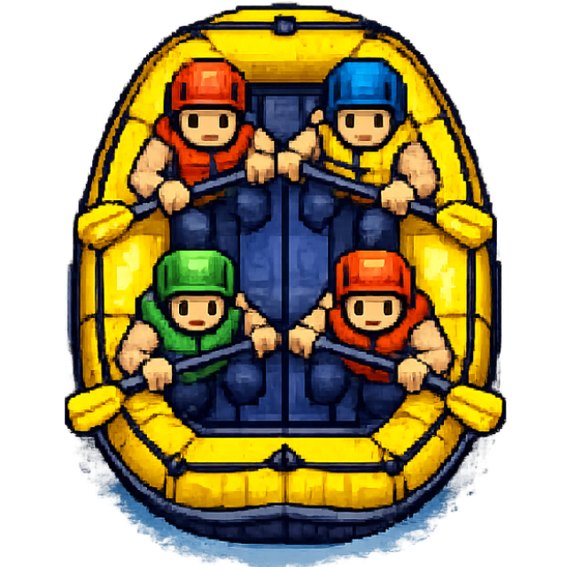
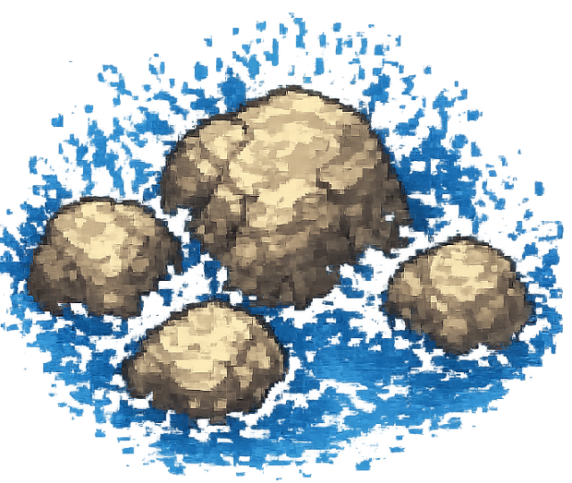
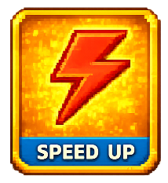
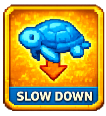

# 🌊 River Rush

> A fast-paced river survival arcade game built with Phaser 3.



## 📖 Game Description
River Rush is an endless vertical-scrolling survival game where you navigate a boat down a treacherous river. Dodge dangerous rocks, collect shiny gold coins, and grab temporary game-changing power-ups to achieve the highest score possible. Keep your coin combo streak going for massive score multipliers and survive as long as you can!

## ✨ Features
- 🌊 **Infinite scrolling river** for endless gameplay
- 🪙 **Coin combo system** with scaling dynamic multipliers
- ⚡ **Power-ups** (speed, slow, invincible) to change the tide
- 💯 **Dynamic scoring system** with floating visual juice
- 📱 **Mobile and desktop controls** for playing anywhere
- ⏸️ **Pause and fullscreen support** built seamlessly into the UI

## 📸 Gameplay Preview

### The Environment
| Boat | River | Obstacles |
|:---:|:---:|:---:|
|  |  |  |

### Power-Ups
| Speed | Slow | Invincible |
|:---:|:---:|:---:|
|  |  |  |

## 🎮 Controls

| Action | Control |
|------|------|
| **Move boat** | Tap on-screen button / Space key |
| **Pause** | Pause (||) button |
| **Fullscreen** | Fullscreen button |

## 🚀 Installation

To run this project locally on your machine:

1. **Clone repository:**
   ```bash
   git clone https://github.com/riveroo/river_rush.git
   cd river_rush
   ```

2. **Install dependencies:**
   ```bash
   npm install
   ```

3. **Run development server:**
   ```bash
   npm run dev
   ```

## 📁 Project Structure

- `src/` - Main source code directory
  - `assets/` - Images, fonts, and other static game resources
  - `scenes/` - Phaser scenes (`BootScene`, `HomeScene`, `GameScene`)
- `index.html` - Game entry point wrapper

## 🛠️ Technologies Used
- **Phaser 3**
- **Vite**
- **JavaScript**

## 🔮 Future Features
- 🏆 Leaderboard system
- 🎵 Sound effects and background music
- ⚙️ Further mobile optimization enhancements
- 🪵 More environmental obstacle types

## 📄 License
This project is licensed under the MIT License - feel free to build upon it.
